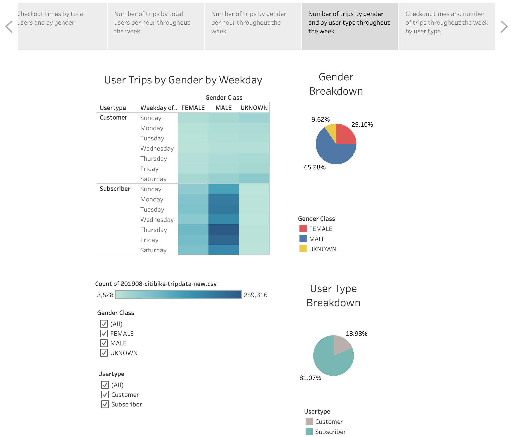

# New York City Bike Sharing Analysis 

# Overview of the Analysis

The study looked at a Citi Bike data set containing the trip history of 1,048,575 bike rides in New York City in August 2019. Information such as bike trip duration, starting and ending points of trips and user demographics were among the many variables analyzed to create informative visualizations on Tableau. Key findings on bike usage trends were presented on Tableau dashboards and stories with various filters on gender, user type, trip count, and trip duration. The insights gained from these visualizations will help inform entrepreneurs about the feasibility of opening a similar bike sharing program in Des Moines, Iowa. The study also aims to convince investors to provide seed funding for this new business venture. 

# Results

The following visualizatiuons were uploaded as part of a Tableau story entitled:

[NYC Bike Sharing](https://public.tableau.com/views/NYC_Bike_Sharing/NYCBikeSharing?:language=en&:display_count=y&publish=yes&:origin=viz_share_link)

 

    <strong> Number of starting and ending trips per location </strong>  
    

Top Starting Locations 
- Most bike trips began in Midtown and Lower Manhattan. At least 5000 bike trips each began in most of the stations located there. 
- Less than about 4000 bike trips each originated from most of the stations in Brooklyn and northwest of Queens.  
- No trips began in Jersey City 

Top Ending Locations 
- Most of the bike trips ended at Midtown and Lower Manhattan.  Several stations there were terminal points for at least 5000 bike trips each. 
- Fewer than 4000 bikers per station ended their trips in Brooklyn and northwest Queens 
- No more than 2 trips each ended in stations in Jersey city. 

    <strong> Checkout times by total users and by gender </strong>  
    

Checkout Times for Users 
- Most users checkout their bikes for a maximum of 5 minutes. Exactly 146,752 users checked out their bikes for this long in August 2019. 
- After 30 minutes, no trip duration corresponds to anything more than 21,346 trips. 
- After 1 hour, no trip duration corresponds to anything more than 982 trips. 

Checkout Times by Gender 
- The shapes of the distribution of trip duration for males and females are similar 
- For both genders, the 5-6 minute trip duration is the most common.  
- More males relative to females checkout bikes at every trip duration.

    <strong> Number of trips by total users per hour throughout the week </strong>  
    

Trips by Weekday per hour 
- More trips were made on the weekdays from 6am to 9am and 5pm to 8pm. 
- Thursday was the busiest day of the week with 408,622 trips made
- Wednesday was the least busy with 266,047 trips made

    <strong> Number of trips by gender per hour throughout the week </strong>  
    

Trips by Gender (Weekday per Hour)
- Both males and females use the bike sharing program most frequently on the weekdays from 6am to 9am and 5pm to 8pm. 
- For every day throughout the week, more males relative to females take bike trips.

    <strong> Number of trips by gender and by user type throughout the week </strong>  
    

User Trips by Gender by Weekday 
- Both male and female subscribers made more bike trips on weekdays than on weekends.  
- Both male and female customers (non-subscribers) made more trips on Saturday than on any weekday. 
- Male and female subscribers use the bike sharing program more frequently compared to male and female customers (non-subscribers). 

# Summary

The results of the visualizations reveal that in August 2019, the bike rides in New York City started and ended in densely populated and highly urbanized areas. Since the bikes were most frequently checked out for a duration of 5 minutes, it can be concluded that they were used for quick trips over short distances. People most likely used them to run quick errands or to cut through congested traffic within the city. The service may also be used by people in their daily commute to and from work since bike sharing usage peaked during the early morning and late afternoon rush hours. Although males and females have similar trip duration patterns, more males used the bike sharing program compared females. In terms of customer type, male and female subscribers made more bike trips compared to male and female customers (non-subscribers). Finally, the heat maps show that subscribers primarily used the service on weekdays while customers mostly used it on weekends, most notably on Saturdays. 

The insights learned from the New York bike sharing study suggest that a similar program will be successful in another city like De Moines, Iowa if majority of the stations are located in the busy downtown core. Placing stations close to bus stops and subway/train stations will enable users to better connect to public transportation. This will help integrate the bike sharing service into people’s daily commute and maintain its regular usage. Since the peak of bike usage coincides with the rush hours, bike repairs and maintenance should be scheduled during the middle of the day or late in the evening. Finally, special promotions can be offered to both customers and subscribers who use the bike sharing service on different times and days of the week. For instance, lower rates per trip can be offered during the non-peak hours to both subscribers and customers. Greater savings and special group discounts should be offered to retain subscribers and to encourage customers to subscribe. 

One additional visualization is a line graph depicting the checkout times by usertype. This demonstrates how more subscribers checkout bikes than customers (non-subscribers) at every trip duration less than 45 minutes. 

Another visualization is a line graph showing the total number of trips made by subscribers and customers (non-subscribers) for each day of the week. This demonstrates how subscribers take more trips than customers on every day of the week. It also shows the difference in bike usage trends for both user types. The number of trips that subscribers took increased as the week progressed and declined towards the weekend. The opposite trend was observed for customers whose usage declined for the first few weekdays but peaked over the weekend.  

 

    <strong> Checkout times and number of trips throughout thge week by user type </strong>  
    

